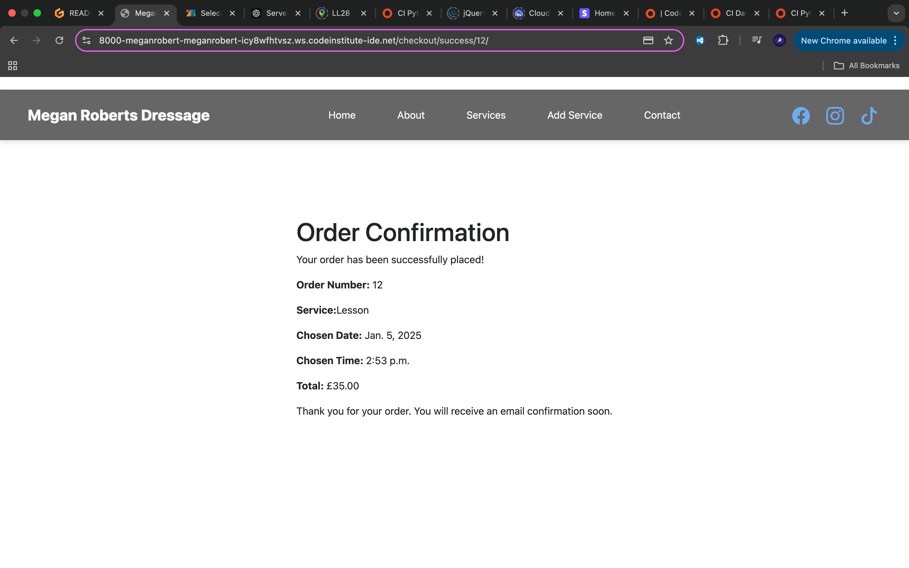
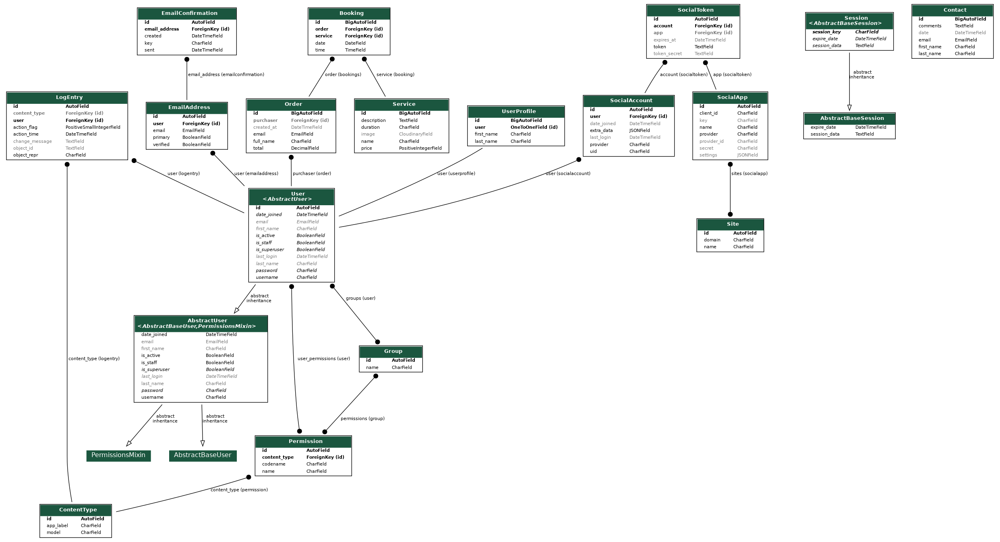

# [Megan Roberts Dressage](https://megan-roberts-dressage-48ee9d19dcc1.herokuapp.com)

[](https://github.com/MeganRoberts-dev/megan-roberts-dressage/commits/main)
[](https://github.com/MeganRoberts-dev/megan-roberts-dressage/commits/main)
[](https://github.com/MeganRoberts-dev/megan-roberts-dressage)

### Welcome to the World of Dressage

Step into the elegant world of dressage with me — a sleek, professional platform I’ve personally created to showcase my career in dressage and my new skills as a developer. Over the past year, I’ve been learning software development, mastering HTML, CSS, Python, JavaScript, and the Django framework, and this app is the culmination of that journey. 

### What Makes It Special?

**A Seamless Booking Experience with Secure Payments:**  
Booking sessions is effortless with a smooth checkout system powered by Stripe, ensuring secure and hassle-free transactions.

**A Personal Touch:**  
The vibrant “About” section shares my dressage journey—my achievements, my passion, and the artistry of this sport—brought to life with stunning visuals.

**Smart Communication Features:**  
Reach out easily with the contact system and receive instant email responses, blending professionalism with convenience.

**Simple Location Details:**  
Plan your visit with ease, thanks to integrated location information.

**Why This Matters**  
This platform is more than just a website—it’s a reflection of my dedication to both dressage and software development. It’s about blending my two loves - equestrian sport and cutting-edge technology, creating a space that’s inspiring, functional, and personal. Whether you're an equestrian enthusiast or curious about dressage, this platform is designed to connect and inspire. Built with heart, passion, and code — this is Megan Roberts Dressage.


source: [megan-roberts-dressage amiresponsive](https://ui.dev/amiresponsive?url=https://megan-roberts-dressage-48ee9d19dcc1.herokuapp.com)

## UX

### Colour Scheme

I used [coolors.co](https://coolors.co/080708-3772ff-df2935-fdca40-e6e8e6) to generate my color palette.

- `#333` primary text.
- `#6dadf1` primary highlights.
- `#ffffff` secondary text.
- `#007bff` secondary highlights.


### Typography
- [Font Awesome](https://fontawesome.com) icons were used throughout the site, such as the social media icons in the footer.

## User Stories

| Target | Expectation | Outcome |
| --- | --- | --- |
| As a guest user | I would like to learn more about Megan Roberts and her expertise | so that I can feel confident in booking services. |
| As a guest user | I would like to find the location of Megan’s training facility | so that I can plan a visit for lesson. |
| As a guest user | I would like to contact Megan through a form | so that I can ask questions or request additional information. |
| As a guest user | I would like to securely pay for my booking through Stripe | so that I feel confident in the safety of my transaction. |
| As a guest user | I would like to receive a confirmation email after booking a service or submitting a form | so that I can verify my appointment or quarry details. |
| As a returning client | I would like to quickly book additional services | so that I can easily schedule future lessons. |
| As an admin user | I would like to update service details and pricing | so that clients always have accurate information. |
| As an admin user | I would like to track payments and bookings | so that I can ensure all transactions are accounted for. |
| As an admin user | I would like to send follow-up emails to clients | so that I can maintain good communication and gather feedback. |


## Wireframes

To follow best practice, wireframes were developed.
I've used [Figma](https://www.figma.com/board/l2P9ZpD1xivVZg4eyKb2yn/Megan-Roberts-Dressage?node-id=0-1&p=f&t=nEYnIcYq03yOjlIt-0) to design my site wireframes.

| Wireframe |
| --- | 
|     |


## Features

### Existing Features

| Feature | Notes | Screenshot |
| --- | --- | --- |
| Home | The site has an inviting home page, with clear information, directive buttons and location map. |     |
| Service Details | Displays detailed information about a selected product, including its name, description, price, an image, and available sizes. |  |
| Proceed to checkout | Users can view the contents of their service or remove item. |  |
| Checkout | Users can checkout as guests, provide their delivery details and payment information using Stripe integration. |  |
| Order Confirmation | Users receive an on-screen and email confirmation with details of their purchase. |  |
| Product Management | Superusers can add, edit, and delete products from the site via a CRUD interface. |   |
| About Page | There is a clear and immersive about page, with picture carousel. |   |
| Contact | Users can submit a message via the contact form, which stores their name, email, and message in the database and will trigger an automated email. |   |
| Login, Sign up and Profile Page | There is an option for users to sign up, login and access a prfoile page and handles all secuirty credentials correctly through DJango. |   |
| Heroku Deployment | The site is deployed to Heroku, making it accessible online for users. |  |

### Future Features

- **Discount Codes and Vouchers**: Allow the admin to create discount codes or vouchers for promotions and marketing campaigns.
- **Interactive FAQ Section**: Use an AI-powered chatbot to provide instant answers to common questions about dressage, bookings, and more.
- **Client Testimonials and Community Reviews**: Add a space for clients to leave testimonials or reviews about their experiences, encouraging community engagement and trust-building.
- **Product Bundles**: Offer discounted product bundles (e.g., buy 3 for the price of 2) or custom product kits.
- **Social Media Integration**: Enable users to share services directly to social media platforms or implement a social login for quick account creation.

## Tools & Technologies

| Tool / Tech | Use |
| --- | --- |
| [](https://markdown.2bn.dev) | Generate README and TESTING templates. |
| [](https://git-scm.com) | Version control. (`git add`, `git commit`, `git push`) |
| [](https://github.com) | Secure online code storage. |
| [](https://gitpod.io) | Cloud-based IDE for development. |
| [](https://en.wikipedia.org/wiki/HTML) | Main site content and layout. |
| [](https://en.wikipedia.org/wiki/CSS) | Design and layout. |
| [](https://www.javascript.com) | User interaction on the site. |
| [](https://jquery.com) | User interaction on the site. |
| [](https://www.python.org) | Back-end programming language. |
| [](https://www.heroku.com) | Hosting the deployed back-end site. |
| [](https://getbootstrap.com) | Front-end CSS framework for modern responsiveness and pre-built components. |
| [](https://www.djangoproject.com) | Python framework for the site. |
| [](https://www.postgresql.org) | Relational database management. |
| [](https://whitenoise.readthedocs.io) | Serving static files with Heroku. |
| [](https://stripe.com) | Online secure payments of e-commerce products/services. |
| [](https://mail.google.com) | Sending emails in my application. |
| [](https://fontawesome.com) | Icons. |
| [](https://chat.openai.com) | Help debug, troubleshoot, and explain things. |
| [](https://mermaid.live) | Generate an interactive diagram for the data/schema. |

## Database Design

### Data Model

Entity Relationship Diagrams (ERD) help to visualize database architecture before creating models. Understanding the relationships between different tables can save time later in the project.


I have used `Mermaid` to generate an interactive ERD of my project.


### Explanation:
1. **Entities**:
   - The entities `User`, `Service`, `Contact`, `Order`, and `Booking` correspond to the Django models.
2. **Relationships**:
   - `User` places `Order`.
   - `Order` contains multiple `Booking` entries.
   - `Service` is referenced in `Booking`.

source: [Mermaid](https://mermaid.live/edit#pako:eNqVVcFu2zAM_RVD57RIHLdpfRs6DBg2bB2GXYYAhmIxjlBZcimqqdvk3yfbSVPHceP5kBh8TyRFPtKvLDUCWMwAP0ueIc_nOvDPHwsYvDbv1SM1BVIE998OpieO6Ypj4DxV8xy6CORcqq654NauDYoG2c71IeQ9mqVUMDCygCV3ipJiZTQk2uULwH6WJQSghAuBYO1kKDHsJ5JZ68Rgkkoq-1mpcfojvDCWqiac8YDliXoFm83FxWbTql0crLhNfEX2xDtOkBksB1b1dC-XKEELVSYH-C0TH1m4lAb6tw_uXFCCZ_K3tynKgqTRB2RhjKrvZ-UL2INdQCpzroICZQpdM3KSOuuG9WAGicN3Kq1NzW_PNauam82hrHGwAGV0Zr0g9tyfKAYPkKm4vfJdOqWS_5uvD8ehJabWsV4dfqzzs3N1dp6OJ0T4ypLMoX7pNlOAkk-ApZ8LS124KScZ4qoL-g2nxTFYy82gzKTmKlnw7OQdZAFJIY-3Vt3o71LDV4L8TMMr06Pjmlp13KemvBPpnRxn99afRn618k8lsddlO6NmG-Rcl6fy3R3ZK7tfyTtie890yT9gbRUQDdb-Owm_3ebOaOKD18mg0ag7nHv1daf6y6dfAyM9OrDtbVS75dqu94O2ZSOWA_rgwn9Ta7dzRivwKbLYvwqOD3M21xWPOzK_S52ymNDBiLmikvvuK8ziJVfWWwuuWfzKnlk8jSaXN9ez8HoyHc_C8TiajVjJ4ovp5XUUTqMovLqdXd2Et-FsO2Ivxngfk8vxZBpGkT_m_zxW-_tbY01QNC5b7YJt_wE0ZoQj)

> [!NOTE]

I have used `pygraphviz` and `django-extensions` to auto-generate an ERD.

The steps taken were as follows:
- In the terminal: `sudo apt update`
- then: `sudo apt-get install python3-dev graphviz libgraphviz-dev pkg-config`
- then type `Y` to proceed
- then: `pip3 install django-extensions pygraphviz`
- in my `settings.py` file, I added the following to my `INSTALLED_APPS`:
```python
INSTALLED_APPS = [
    ...
    'django_extensions',
    ...
]
```
- back in the terminal: `python3 manage.py graph_models -a -o erd.png`
- drag the new `erd.png` file into my `documentation/` folder
- removed `'django_extensions',` from my `INSTALLED_APPS`
- finally, in the terminal: `pip3 uninstall django-extensions pygraphviz -y`



source: [medium.com](https://medium.com/@yathomasi1/1-using-django-extensions-to-visualize-the-database-diagram-in-django-application-c5fa7e710e16)

## Testing

> [!NOTE]
> For all testing, please refer to the [TESTING.md](TESTING.md) file.

## Deployment

The live deployed application can be found deployed on [Heroku](https://megan-roberts-dressage-48ee9d19dcc1.herokuapp.com/).

### Heroku Deployment

This project uses [Heroku](https://www.heroku.com), a platform as a service (PaaS) that enables developers to build, run, and operate applications entirely in the cloud.

Deployment steps are as follows, after account setup:

- Select **New** in the top-right corner of your Heroku Dashboard, and select **Create new app** from the dropdown menu.
- Your app name must be unique, and then choose a region closest to you (EU or USA), then finally, click **Create App**.
- From the new app **Settings**, click **Reveal Config Vars**, and set your environment variables to match your private `env.py` file.

> [!IMPORTANT]
> This is a sample only; you would replace the values with your own if cloning/forking my repository.

| Key | Value |
| --- | --- |
| `DATABASE_URL` | user-inserts-own-postgres-database-url |
| `DISABLE_COLLECTSTATIC` | 1 (*this is temporary, and can be removed for the final deployment*) |
| `EMAIL_HOST_PASS` | user-inserts-own-gmail-api-key |
| `EMAIL_HOST_USER` | user-inserts-own-gmail-email-address |
| `SECRET_KEY` | any-random-secret-key |
| `STRIPE_PUBLIC_KEY` | user-inserts-own-stripe-public-key |
| `STRIPE_SECRET_KEY` | user-inserts-own-stripe-secret-key |
| `STRIPE_WH_SECRET` | user-inserts-own-stripe-webhook-secret |

Heroku needs three additional files in order to deploy properly.

- [requirements.txt](requirements.txt)
- [Procfile](Procfile)
- [runtime.txt](runtime.txt)

You can install this project's **[requirements.txt](requirements.txt)** (*where applicable*) using:

- `pip3 install -r requirements.txt`

If you have your own packages that have been installed, then the requirements file needs updated using:

- `pip3 freeze --local > requirements.txt`

The **[Procfile](Procfile)** can be created with the following command:

- `echo web: gunicorn app_name.wsgi > Procfile`
- *replace `app_name` with the name of your primary Django app name; the folder where `settings.py` is located*

The **[runtime.txt](runtime.txt)** file needs to know which Python version is being used:
1. type: `python3 --version` in the terminal.
2. in the **[runtime.txt](runtime.txt)** file, add your Python version:
	- `python-3.12.3`

For Heroku deployment, follow these steps to connect your own GitHub repository to the newly created app:

Either (*recommended*):

- Select **Automatic Deployment** from the Heroku app.

Or:

- In the Terminal/CLI, connect to Heroku using this command: `heroku login -i`
- Set the remote for Heroku: `heroku git:remote -a app_name` (*replace `app_name` with your app name*)
- After performing the standard Git `add`, `commit`, and `push` to GitHub, you can now type:
	- `git push heroku main`

The project should now be connected and deployed to Heroku!

### PostgreSQL

This project uses a [Code Institute PostgreSQL Database](https://dbs.ci-dbs.net) for the Relational Database with Django.

> [!CAUTION]
> - PostgreSQL databases by Code Institute are only available to CI Students.
> - You must acquire your own PostgreSQL database through some other method if you plan to clone/fork this repository.
> - Code Institute students are allowed a maximum of 8 databases.
> - Databases are subject to deletion after 18 months.

To obtain my own Postgres Database from Code Institute, I followed these steps:

- Submitted my email address to the CI PostgreSQL Database link above.
- An email was sent to me with my new Postgres Database.
- The Database connection string will resemble something like this:
    - `postgres://<db_username>:<db_password>@<db_host_url>/<db_name>`
- You can use the above URL with Django; simply paste it into your `env.py` file and Heroku Config Vars as `DATABASE_URL`.

### Stripe API

This project uses [Stripe](https://stripe.com) to handle the ecommerce payments.

Once you've created a Stripe account and logged-in, follow these series of steps to get your project connected.

- From your Stripe dashboard, click to expand the "Get your test API keys".
- You'll have two keys here:
	- `STRIPE_PUBLIC_KEY` = Publishable Key (starts with **pk**)
	- `STRIPE_SECRET_KEY` = Secret Key (starts with **sk**)

As a backup, in case users prematurely close the purchase-order page during payment, we can include Stripe Webhooks.

- From your Stripe dashboard, click **Developers**, and select **Webhooks**.
- From there, click **Add Endpoint**.
	- `https://megan-roberts-dressage-48ee9d19dcc1.herokuapp.com/checkout/wh/`
- Click **receive all events**.
- Click **Add Endpoint** to complete the process.
- You'll have a new key here:
	- `STRIPE_WH_SECRET` = Signing Secret (Wehbook) Key (starts with **wh**)

### Gmail API

This project uses [Gmail](https://mail.google.com) to handle sending emails to users for purchase order confirmations.

Once you've created a Gmail (Google) account and logged-in, follow these series of steps to get your project connected.

- Click on the **Account Settings** (cog icon) in the top-right corner of Gmail.
- Click on the **Accounts and Import** tab.
- Within the section called "Change account settings", click on the link for **Other Google Account settings**.
- From this new page, select **Security** on the left.
- Select **2-Step Verification** to turn it on. (*verify your password and account*)
- Once verified, select **Turn On** for 2FA.
- Navigate back to the **Security** page, and you'll see a new option called **App passwords** (*search for it at the top, if not*).
- This might prompt you once again to confirm your password and account.
- Select **Mail** for the app type.
- Select **Other (Custom name)** for the device type.
    - Any custom name, such as "Django" or `megan-roberts-dressage`
- You'll be provided with a 16-character password (API key).
    - Save this somewhere locally, as you cannot access this key again later!
    - If your 16-character password contains *spaces*, make sure to remove them entirely.
    - `EMAIL_HOST_PASS` = user's 16-character API key
    - `EMAIL_HOST_USER` = user's own personal Gmail email address

### WhiteNoise

This project uses the [WhiteNoise](https://whitenoise.readthedocs.io/en/latest/) to aid with static files temporarily hosted on the live Heroku site.

To include WhiteNoise in your own projects:

- Install the latest WhiteNoise package:
    - `pip install whitenoise`
- Update the `requirements.txt` file with the newly installed package:
    - `pip freeze --local > requirements.txt`
- Edit your `settings.py` file and add WhiteNoise to the `MIDDLEWARE` list, above all other middleware (apart from Django’s "SecurityMiddleware"):

```python
# settings.py

MIDDLEWARE = [
    'django.middleware.security.SecurityMiddleware',
    'whitenoise.middleware.WhiteNoiseMiddleware',
    # any additional middleware
]
```


### Local Development

This project can be cloned or forked in order to make a local copy on your own system.

For either method, you will need to install any applicable packages found within the [requirements.txt](requirements.txt) file.

- `pip3 install -r requirements.txt`.

You will need to create a new file called `env.py` at the root-level, and include the same environment variables listed above from the Heroku deployment steps.

> [!IMPORTANT]
> This is a sample only; you would replace the values with your own if cloning/forking my repository.

Sample `env.py` file:

```python
import os

os.environ.setdefault("AWS_ACCESS_KEY_ID", "user-inserts-own-aws-access-key-id")
os.environ.setdefault("AWS_SECRET_ACCESS_KEY", "user-inserts-own-aws-secret-access-key")
os.environ.setdefault("DATABASE_URL", "user-inserts-own-postgres-database-url")
os.environ.setdefault("EMAIL_HOST_PASS", "user-inserts-own-gmail-host-api-key")
os.environ.setdefault("EMAIL_HOST_USER", "user-inserts-own-gmail-email-address")
os.environ.setdefault("SECRET_KEY", "any-random-secret-key")
os.environ.setdefault("STRIPE_PUBLIC_KEY", "user-inserts-own-stripe-public-key")
os.environ.setdefault("STRIPE_SECRET_KEY", "user-inserts-own-stripe-secret-key")
os.environ.setdefault("STRIPE_WH_SECRET", "user-inserts-own-stripe-webhook-secret")  # only if using Stripe Webhooks

# local environment only (do not include these in production/deployment!)
os.environ.setdefault("DEBUG", "True")
os.environ.setdefault("DEVELOPMENT", "True")
```

Once the project is cloned or forked, in order to run it locally, you'll need to follow these steps:

- Start the Django app: `python3 manage.py runserver`
- Stop the app once it's loaded: `CTRL+C` (*Windows/Linux*) or `⌘+C` (*Mac*)
- Make any necessary migrations: `python3 manage.py makemigrations --dry-run` then `python3 manage.py makemigrations`
- Migrate the data to the database: `python3 manage.py migrate --plan` then `python3 manage.py migrate`
- Create a superuser: `python3 manage.py createsuperuser`
- Load fixtures (*if applicable*): `python3 manage.py loaddata file-name.json` (*repeat for each file*)
- Everything should be ready now, so run the Django app again: `python3 manage.py runserver`

If you'd like to backup your database models, use the following command for each model you'd like to create a fixture for:

- `python3 manage.py dumpdata your-model > your-model.json`
- *repeat this action for each model you wish to backup*
- **NOTE**: You should never make a backup of the default *admin* or *users* data with confidential information.

#### Cloning

You can clone the repository by following these steps:

1. Go to the [GitHub repository](https://www.github.com/MeganRoberts-dev/megan-roberts-dressage).
2. Locate and click on the green "Code" button at the very top, above the commits and files.
3. Select whether you prefer to clone using "HTTPS", "SSH", or "GitHub CLI", and click the "copy" button to copy the URL to your clipboard.
4. Open "Git Bash" or "Terminal".
5. Change the current working directory to the location where you want the cloned directory.
6. In your IDE Terminal, type the following command to clone the repository:
	- `git clone https://www.github.com/MeganRoberts-dev/megan-roberts-dressage.git`
7. Press "Enter" to create your local clone.

Alternatively, if using Gitpod, you can click below to create your own workspace using this repository.

[](https://gitpod.io/#https://www.github.com/MeganRoberts-dev/megan-roberts-dressage)

**Please Note**: in order to directly open the project in Gitpod, you should have the browser extension installed. A tutorial on how to do that can be found [here](https://www.gitpod.io/docs/configure/user-settings/browser-extension).

#### Forking

By forking the GitHub Repository, you make a copy of the original repository on our GitHub account to view and/or make changes without affecting the original owner's repository. You can fork this repository by using the following steps:

1. Log in to GitHub and locate the [GitHub Repository](https://www.github.com/MeganRoberts-dev/megan-roberts-dressage).
2. At the top of the Repository, just below the "Settings" button on the menu, locate and click the "Fork" Button.
3. Once clicked, you should now have a copy of the original repository in your own GitHub account!

### Local VS Deployment

There are no remaining major differences between the local version when compared to the deployed version online.

## Credits

- [Restaurantly Bootstrap Demo](https://bootstrapmade.com/demo/Restaurantly/)
- [Boutique Ado App](https://github.com/Code-Institute-Solutions/boutique_ado_v1/tree/87b218d7b58c487760672f626a7d149b0d75b4d7)
- [Dressage Club App](https://github.com/MeganRoberts-dev/dressage_club)
- [Nia Wyn Portfolio](https://www.creative.wales/creative-sectors/music/nia-wyn-being-welsh-soul-artist)

### Content

| Source | Notes |
| --- | --- |
| [Markdown Builder](https://markdown.2bn.dev) | Help generating Markdown files |
| [Boutique Ado](https://codeinstitute.net) | Code Institute walkthrough project inspiration |
| [Bootstrap](https://getbootstrap.com) | Various components / responsive front-end framework |
| [Whitenoise](https://whitenoise.readthedocs.io) | Static file service |
| [Stripe](https://docs.stripe.com/payments/elements) | Online payment services |
| [Gmail API](https://developers.google.com/gmail/api/guides) | Sending payment confirmation emails |
| [ChatGPT](https://chatgpt.com) | Help with code logic and explanations |

### Media

I own all the rights to the images used. 

| Source | Notes |
| --- | --- |
| [favicon.io](https://favicon.io) | Generating the favicon |
| [Bootstrap icons](https://icons.getbootstrap.com/) | Icons used throughout the site |

### Acknowledgements

This project has been a significant milestone in my journey, and I’m genuinely proud of what I’ve been able to create. However, I couldn’t have achieved this without the guidance and support of some amazing people.

First and foremost, I want to thank my Code Institute mentor, [Tim Nelson](https://www.github.com/TravelTimN). Tim, your guidance, patience, and thoughtful advice throughout this project have been invaluable. You consistently encouraged me to aim higher and think more critically, and for that, I am truly grateful. I’d also like to thank the [Code Institute](https://codeinstitute.net) Tutor Team for their expertise and help with debugging and overcoming roadblocks along the way.The [Code Institute Slack community](https://code-institute-room.slack.com) deserves a mention too. The support and motivation I found there during challenging moments really kept me moving forward. Finally, a heartfelt thank you to my partner for their constant encouragement and belief in me, and to my employer for supporting me as I work toward this career change.

This project wouldn’t have been possible without all of you — thank you for being there. 
