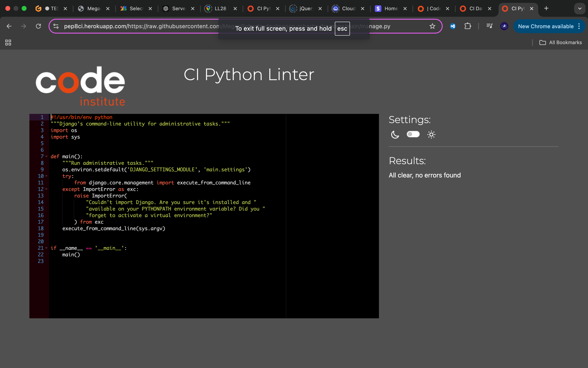
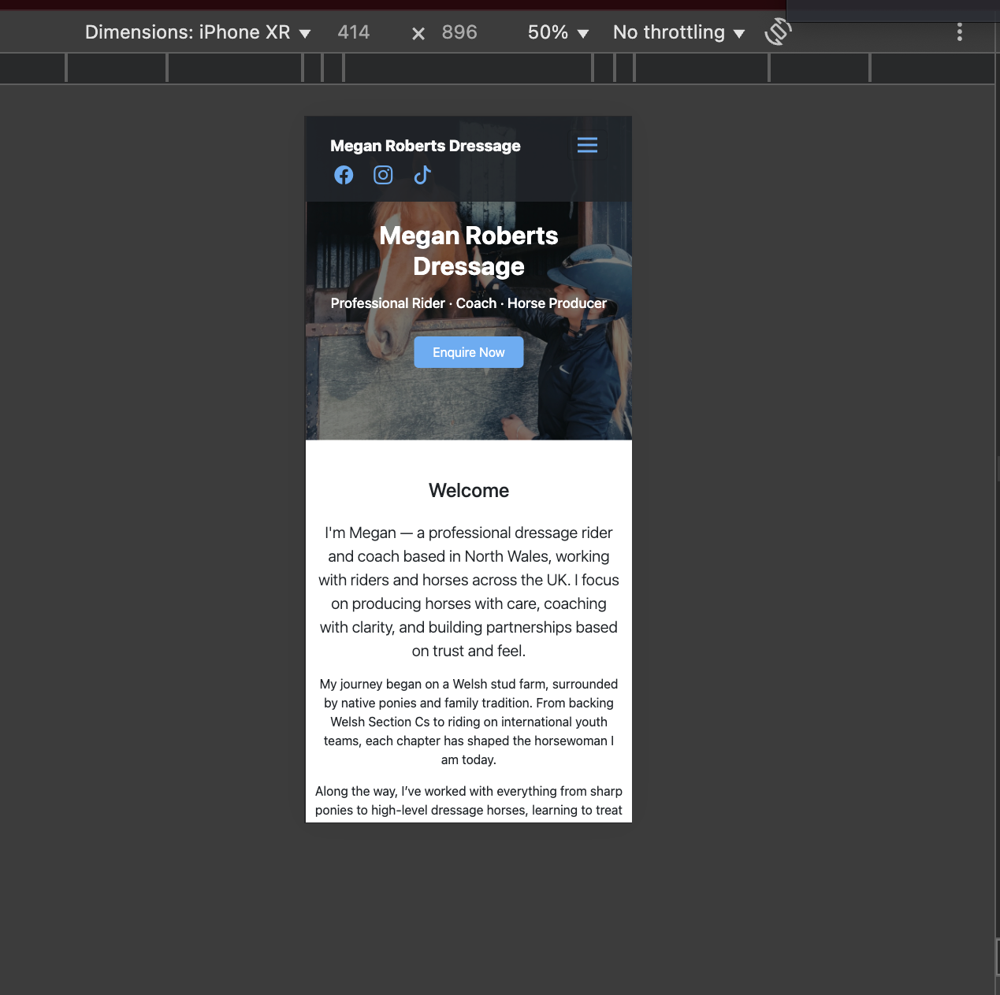
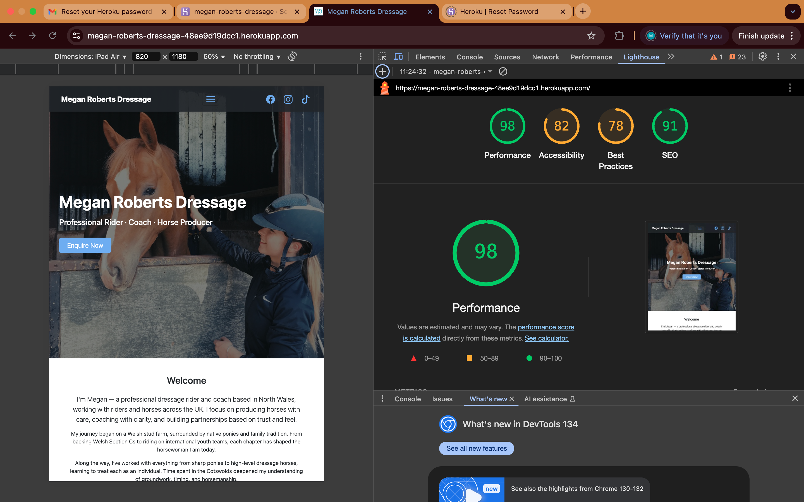

# Testing

> [!NOTE]  
> Return back to the [README.md](README.md) file.

## Code Validation

### HTML

I have used the recommended [HTML W3C Validator](https://validator.w3.org) to validate all of my HTML files.

| Directory | File | Screenshot | Notes |
| --- | --- | --- | --- |
| contact | contact.html |  | |
| home | about.html |  | |
| home | home.html |  | |
| services | services.html |  | |

### CSS

I have used the recommended [CSS Jigsaw Validator](https://jigsaw.w3.org/css-validator) to validate all of my CSS files.

| Directory | File | Screenshot | Notes |
| --- | --- | --- | --- |
| static | styles.css |  | |

### Python

I have used the recommended [PEP8 CI Python Linter](https://pep8ci.herokuapp.com) to validate all of my Python files.

| Directory | File | CI URL | Screenshot | Notes |
| --- | --- | --- | --- | --- |
| contact | forms.py | [PEP8 CI](https://pep8ci.herokuapp.com/https://raw.githubusercontent.com/MeganRoberts-dev/megan-roberts-dressage/main/contact/forms.py) |  | |
| contact | models.py | [PEP8 CI](https://pep8ci.herokuapp.com/https://raw.githubusercontent.com/MeganRoberts-dev/megan-roberts-dressage/main/contact/models.py) |  | |
| contact | urls.py | [PEP8 CI](https://pep8ci.herokuapp.com/https://raw.githubusercontent.com/MeganRoberts-dev/megan-roberts-dressage/main/contact/urls.py) |  | |
| contact | views.py | [PEP8 CI](https://pep8ci.herokuapp.com/https://raw.githubusercontent.com/MeganRoberts-dev/megan-roberts-dressage/main/contact/views.py) |  | |
| home | admin.py | [PEP8 CI](https://pep8ci.herokuapp.com/https://raw.githubusercontent.com/MeganRoberts-dev/megan-roberts-dressage/main/home/admin.py) |  | |
| home | models.py | [PEP8 CI](https://pep8ci.herokuapp.com/https://raw.githubusercontent.com/MeganRoberts-dev/megan-roberts-dressage/main/home/models.py) |  | |
| home | urls.py | [PEP8 CI](https://pep8ci.herokuapp.com/https://raw.githubusercontent.com/MeganRoberts-dev/megan-roberts-dressage/main/home/urls.py) |  | |
| home | views.py | [PEP8 CI](https://pep8ci.herokuapp.com/https://raw.githubusercontent.com/MeganRoberts-dev/megan-roberts-dressage/main/home/views.py) |  | |
| main | settings.py | [PEP8 CI](https://pep8ci.herokuapp.com/https://raw.githubusercontent.com/MeganRoberts-dev/megan-roberts-dressage/main/main/settings.py) |  | |
| main | urls.py | [PEP8 CI](https://pep8ci.herokuapp.com/https://raw.githubusercontent.com/MeganRoberts-dev/megan-roberts-dressage/main/main/urls.py) |  | |
|  | manage.py | [PEP8 CI](https://pep8ci.herokuapp.com/https://raw.githubusercontent.com/MeganRoberts-dev/megan-roberts-dressage/main/manage.py) |  | |
| services | urls.py | [PEP8 CI](https://pep8ci.herokuapp.com/https://raw.githubusercontent.com/MeganRoberts-dev/megan-roberts-dressage/main/services/urls.py) |  | |
| services | views.py | [PEP8 CI](https://pep8ci.herokuapp.com/https://raw.githubusercontent.com/MeganRoberts-dev/megan-roberts-dressage/main/services/views.py) |  | |
| services | models.py | [PEP8 CI](https://pep8ci.herokuapp.com/https://raw.githubusercontent.com/MeganRoberts-dev/megan-roberts-dressage/main/services/models.py) |  | |
| checkout | urls.py | [PEP8 CI](https://pep8ci.herokuapp.com/https://raw.githubusercontent.com/MeganRoberts-dev/megan-roberts-dressage/main/checkout/urls.py) |  | |
| checkout | views.py | [PEP8 CI](https://pep8ci.herokuapp.com/https://raw.githubusercontent.com/MeganRoberts-dev/megan-roberts-dressage/main/checkout/views.py) |  | |
| checkout | models.py | [PEP8 CI](https://pep8ci.herokuapp.com/https://raw.githubusercontent.com/MeganRoberts-dev/megan-roberts-dressage/main/checkout/models.py) |  | |
| checkout | forms.py | [PEP8 CI](https://pep8ci.herokuapp.com/https://raw.githubusercontent.com/MeganRoberts-dev/megan-roberts-dressage/main/checkout/forms.py) |  | |
## Browser Compatibility

I've tested my deployed project on multiple browsers to check for compatibility issues.

| Browser | Desktop| Notes |
| --- | --- | --- |
| Chrome |  | Works as expected |
| Firefox |  | Works as expected |
| Edge |  | Works as expected |
| Opera |  | Works as expected |

## Responsiveness

I've tested my deployed project on multiple devices to check for responsiveness issues.

| Device | Page | Notes |
| --- | --- | --- |
| Desktop |  | Works as expected |
| Mobile (DevTools) |  | Works as expected |
| Tablet (DevTools) |  | Works as expected |
| iPhone SE |  | Works as expected |

## Lighthouse Audit

I've tested my deployed project using the Lighthouse Audit tool to check for any major issues.

| Page |  Desktop | Notes |
| --- | --- | --- |
| Home |  | | Pass |
| About |  | !| Some minor warnings |
| Services |  | Pass |
| Form |  | Pass |

## Defensive Programming

| Page | User Action | Expected Result | Pass/Fail | Comments |
| --- | --- | --- | --- | --- |
| Home | | | | |
| | Click on Logo | Redirection to Home page | Pass | |
| | Click on Home link in navbar | Redirection to Home page | Pass | |
| About | | | | |
| | Click on Gallery link in navbar | Redirection to Gallery page | Pass | |
| | Load gallery images | All images load as expected | Pass | |
| Contact | | | | |
| | Click on Contact link in navbar | Redirection to Contact page | Pass | |
| | Enter first/last name | Field will accept freeform text | Pass | |
| | Enter valid email address | Field will only accept email address format | Pass | |
| | Enter message in textarea | Field will accept freeform text | Pass | |
| | Click the Submit button | Redirects user to form-dump | Pass | User must click 'Back' button to return |
| | Enter valid email address | Field will only accept email address format | Pass | ||
| | Confirm email | Redirects user to contact page | Pass | |

## User Story Testing

| User Story | Screenshot |
| --- | --- |
| As a new site user, I would like to learn more about Megan Roberts and her expertise, so that I can feel confident in booking services. |  |
| As a new site user, I would like to find the location of Megan’s training facility, so that I can plan a visit for lesson. |  |
| As a new site user, I would like to contact Megan through a form, so that I can ask questions or request additional information. |  |
| As a returning site user, I would like to securely pay for my booking through Stripe, so that I feel confident in the safety of my transaction. |  |
| As a returning site user,  I would like to quickly book additional services, so that I can easily schedule future lessons.  |  |
| As a site administrator, I would like to update service details and pricing, so that clients always have accurate information. |  |
| As a site administrator, I would like to track payments and bookings, so that I can ensure all transactions are accounted for.  |  |

## Automated Testing

I have conducted a series of automated tests on my application.

I fully acknowledge and understand that, in a real-world scenario, an extensive set of additional tests would be more comprehensive.

### JavaScript (Jest Testing)

I have used the [Jest](https://jestjs.io) JavaScript testing framework to test the application functionality.

In order to work with Jest, I first had to initialize NPM.

- `npm init`
- Hit `enter` for all options, except for **test command:**, just type `jest`.

Add Jest to a list called **Dev Dependencies** in a dev environment:

- `npm install --save-dev jest`

**IMPORTANT**: Initial configurations

When creating test files, the name of the file needs to be `file-name.test.js` in order for Jest to properly work.

Without the following, Jest won't properly run the tests:

- `npm install -D jest-environment-jsdom`

Due to a change in Jest's default configuration, you'll need to add the following code to the top of the `.test.js` file:

```js
/**
 * @jest-environment jsdom
 */

const { test, expect } = require("@jest/globals");
const { function1, function2, function3, etc. } = require("../script-name");

beforeAll(() => {
    let fs = require("fs");
    let fileContents = fs.readFileSync("index.html", "utf-8");
    document.open();
    document.write(fileContents);
    document.close();
});
```

Remember to adjust the `fs.readFileSync()` to the specific file you'd like you test.
The example above is testing the `index.html` file.

Finally, at the bottom of the script file where your primary scripts are written, include the following at the bottom of the file.
Make sure to include the name of all of your functions that are being tested in the `.test.js` file.

```js
if (typeof module !== "undefined") module.exports = {
    function1, function2, function3, etc.
};
```

Now that these steps have been undertaken, further tests can be written, and be expected to fail initially.
Write JS code that can get the tests to pass as part of the Red-Green refactor process.

Once ready, to run the tests, use this command:

- `npm test`

**NOTE**: To obtain a coverage report, use the following command:

- `npm test --coverage`

## Bugs


- Fix stripe element java script bug.

    

    - To fix this, I changed the Selector to an Element id.

- Toggler html bug.

    

    - To fix this, I changed the syntax to span.

- Python `order` display.

    

    - To fix this, I changed the order_number which was not valid, to order.

## Unfixed Bugs

- On devices smaller than 375px, the about page carousel starts to have `overflow`.
  - Attempted fix: I tried to add additional media queries to handle this, but things started becoming too small to read.

> [!NOTE]  
> There are no remaining bugs that I am aware of
> Not all testing could be completed due to time constraints 
