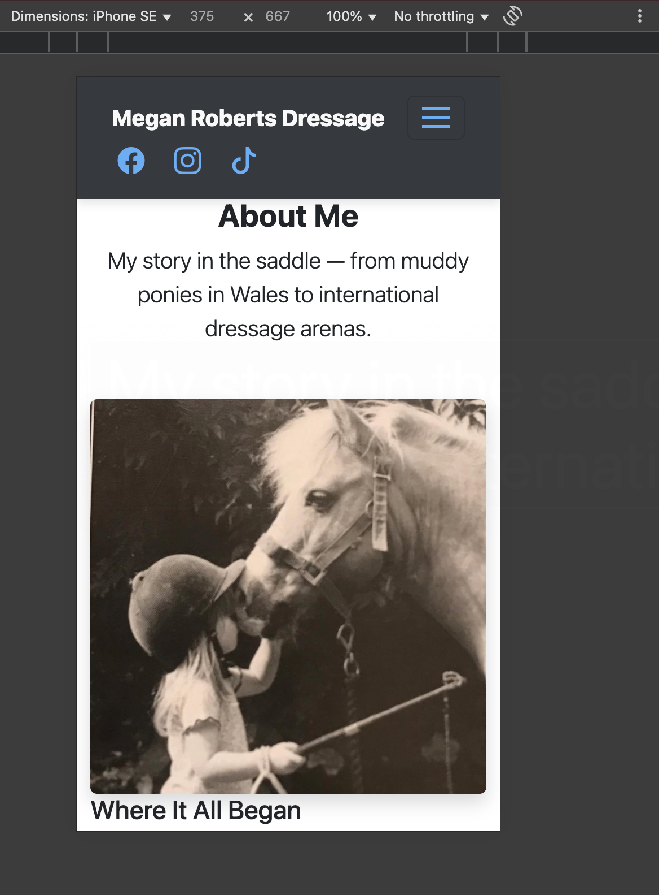
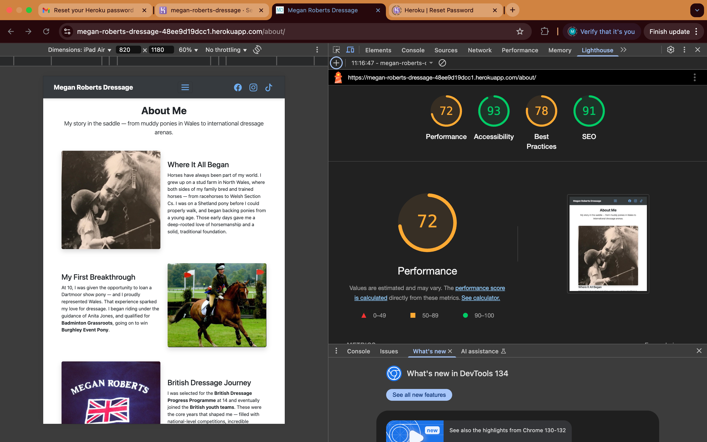
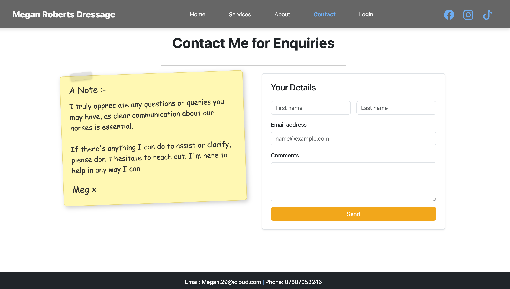
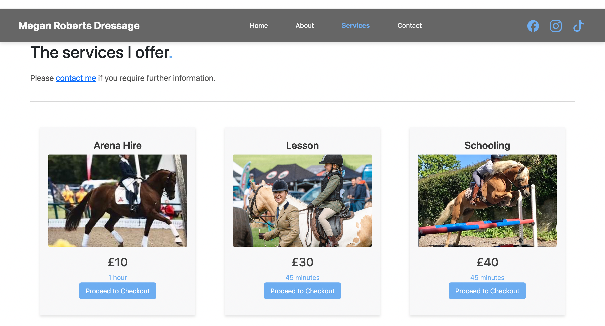

# Testing

> [!NOTE]  
> Return back to the [README.md](README.md) file.

## Code Validation

### HTML

I have used the recommended [HTML W3C Validator](https://validator.w3.org) to validate all of my HTML files.

| Directory | File | Screenshot | Notes |
| --- | --- | --- | --- |
| contact | contact.html |  | |
| home | about.html |  | |
| home | home.html |  | |
| services | services.html |  | |

### CSS

I have used the recommended [CSS Jigsaw Validator](https://jigsaw.w3.org/css-validator) to validate all of my CSS files.

| Directory | File | Screenshot | Notes |
| --- | --- | --- | --- |
| static | styles.css |  | |

### Python

I have used the recommended [PEP8 CI Python Linter](https://pep8ci.herokuapp.com) to validate all of my Python files.

| Directory | File | CI URL | Screenshot | Notes |
| --- | --- | --- | --- | --- |
| contact | forms.py | [PEP8 CI](https://pep8ci.herokuapp.com/https://raw.githubusercontent.com/MeganRoberts-dev/megan-roberts-dressage/main/contact/forms.py) |  | |
| contact | models.py | [PEP8 CI](https://pep8ci.herokuapp.com/https://raw.githubusercontent.com/MeganRoberts-dev/megan-roberts-dressage/main/contact/models.py) |  | |
| contact | urls.py | [PEP8 CI](https://pep8ci.herokuapp.com/https://raw.githubusercontent.com/MeganRoberts-dev/megan-roberts-dressage/main/contact/urls.py) |  | |
| contact | views.py | [PEP8 CI](https://pep8ci.herokuapp.com/https://raw.githubusercontent.com/MeganRoberts-dev/megan-roberts-dressage/main/contact/views.py) |  | |
| home | admin.py | [PEP8 CI](https://pep8ci.herokuapp.com/https://raw.githubusercontent.com/MeganRoberts-dev/megan-roberts-dressage/main/home/admin.py) |  | |
| home | models.py | [PEP8 CI](https://pep8ci.herokuapp.com/https://raw.githubusercontent.com/MeganRoberts-dev/megan-roberts-dressage/main/home/models.py) |  | |
| home | urls.py | [PEP8 CI](https://pep8ci.herokuapp.com/https://raw.githubusercontent.com/MeganRoberts-dev/megan-roberts-dressage/main/home/urls.py) |  | |
| home | views.py | [PEP8 CI](https://pep8ci.herokuapp.com/https://raw.githubusercontent.com/MeganRoberts-dev/megan-roberts-dressage/main/home/views.py) |  | |
| main | settings.py | [PEP8 CI](https://pep8ci.herokuapp.com/https://raw.githubusercontent.com/MeganRoberts-dev/megan-roberts-dressage/main/main/settings.py) |  | |
| main | urls.py | [PEP8 CI](https://pep8ci.herokuapp.com/https://raw.githubusercontent.com/MeganRoberts-dev/megan-roberts-dressage/main/main/urls.py) |  | |
|  | manage.py | [PEP8 CI](https://pep8ci.herokuapp.com/https://raw.githubusercontent.com/MeganRoberts-dev/megan-roberts-dressage/main/manage.py) |  | |
| services | urls.py | [PEP8 CI](https://pep8ci.herokuapp.com/https://raw.githubusercontent.com/MeganRoberts-dev/megan-roberts-dressage/main/services/urls.py) |  | |
| services | views.py | [PEP8 CI](https://pep8ci.herokuapp.com/https://raw.githubusercontent.com/MeganRoberts-dev/megan-roberts-dressage/main/services/views.py) |  | |
| services | models.py | [PEP8 CI](https://pep8ci.herokuapp.com/https://raw.githubusercontent.com/MeganRoberts-dev/megan-roberts-dressage/main/services/models.py) |  | |
| checkout | urls.py | [PEP8 CI](https://pep8ci.herokuapp.com/https://raw.githubusercontent.com/MeganRoberts-dev/megan-roberts-dressage/main/checkout/urls.py) |  | |
| checkout | views.py | [PEP8 CI](https://pep8ci.herokuapp.com/https://raw.githubusercontent.com/MeganRoberts-dev/megan-roberts-dressage/main/checkout/views.py) |  | |
| checkout | models.py | [PEP8 CI](https://pep8ci.herokuapp.com/https://raw.githubusercontent.com/MeganRoberts-dev/megan-roberts-dressage/main/checkout/models.py) |  | |
| checkout | forms.py | [PEP8 CI](https://pep8ci.herokuapp.com/https://raw.githubusercontent.com/MeganRoberts-dev/megan-roberts-dressage/main/checkout/forms.py) |  | |
| profiles | urls.py | [PEP8 CI](https://pep8ci.herokuapp.com/https://raw.githubusercontent.com/MeganRoberts-dev/megan-roberts-dressage/main/profiles/urls.py) |  | |
| profiles | views.py | [PEP8 CI](https://pep8ci.herokuapp.com/https://raw.githubusercontent.com/MeganRoberts-dev/megan-roberts-dressage/main/profiles/views.py) |  | |
| profiles | models.py | [PEP8 CI](https://pep8ci.herokuapp.com/https://raw.githubusercontent.com/MeganRoberts-dev/megan-roberts-dressage/main/profiles/models.py) |  | |
| profiles | forms.py | [PEP8 CI](https://pep8ci.herokuapp.com/https://raw.githubusercontent.com/MeganRoberts-dev/megan-roberts-dressage/main/profiles/forms.py) |  | |
## Browser Compatibility

I've tested my deployed project on multiple browsers to check for compatibility issues.

| Browser | Desktop| Notes |
| --- | --- | --- |
| Chrome |  | Works as expected |
| Firefox |  | Works as expected |
| Edge |  | Works as expected |
| Opera |  | Works as expected |

## Responsiveness

I've tested my deployed project on multiple devices to check for responsiveness issues.

| Device | Page | Notes |
| --- | --- | --- |
| Desktop |  | Works as expected |
| Mobile (DevTools) |  | Works as expected |
| Tablet (DevTools) |  | Works as expected |
| iPhone SE |  | Works as expected |

## Lighthouse Audit

I've tested my deployed project using the Lighthouse Audit tool to check for any major issues.

| Page |  Desktop | Notes |
| --- | --- | --- |
| Home |  | | Pass |
| About |  | !| Some minor warnings |
| Services |  | Pass |
| Form |  | Pass |

## Defensive Programming

| Page | User Action | Expected Result | Pass/Fail | Comments |
| --- | --- | --- | --- | --- |
| Home | | | | |
| | Click on Logo | Redirection to Home page | Pass | |
| | Click on Home link in navbar | Redirection to Home page | Pass | |
| About | | | | |
| | Click on Gallery link in navbar | Redirection to Gallery page | Pass | |
| | Load gallery images | All images load as expected | Pass | |
| Contact | | | | |
| | Click on Contact link in navbar | Redirection to Contact page | Pass | |
| | Enter first/last name | Field will accept freeform text | Pass | |
| | Enter valid email address | Field will only accept email address format | Pass | |
| | Enter message in textarea | Field will accept freeform text | Pass | |
| | Click the Submit button | Redirects user to form-dump | Pass | User must click 'Back' button to return |
| | Enter valid email address | Field will only accept email address format | Pass | ||
| | Confirm email | Redirects user to contact page | Pass | |

## User Story Testing

| User Story | Screenshot |
| --- | --- |
| As a new site user, I would like to learn more about Megan Roberts and her expertise, so that I can feel confident in booking services. |  |
| As a new site user, I would like to find the location of Megan’s training facility, so that I can plan a visit for lesson. |  |
| As a new site user, I would like to contact Megan through a form, so that I can ask questions or request additional information. |  |
| As a returning site user, I would like to securely pay for my booking through Stripe, so that I feel confident in the safety of my transaction. |  |
| As a returning site user,  I would like to quickly book additional services, so that I can easily schedule future lessons.  |  |
| As a site administrator, I would like to update service details and pricing, so that clients always have accurate information. |  |
| As a site administrator, I would like to track payments and bookings, so that I can ensure all transactions are accounted for.  |  |

## Automated Testing

I have conducted a series of automated tests on my application.

> [!NOTE]
> I fully acknowledge and understand that, in a real-world scenario, an extensive set of additional tests would be more comprehensive.

### Python (Unit Testing)

⚠️ INSTRUCTIONS ⚠️

Adjust the code below (file names, function names, etc.) to match your own project files/folders. Use these notes loosely when documenting your own Python Unit tests, and remove/adjust where applicable.

⚠️ SAMPLE ⚠️

I have used Django's built-in unit testing framework to test the application functionality. In order to run the tests, I ran the following command in the terminal each time:

- `python3 manage.py test name-of-app`

To create the coverage report, I would then run the following commands:

- `pip3 install coverage`
- `pip3 freeze --local > requirements.txt`
- `coverage run --omit=*/site-packages/*,*/migrations/*,*/__init__.py,env.py,manage.py test`
- `coverage report`

To see the HTML version of the reports, and find out whether some pieces of code were missing, I ran the following commands:

- `coverage html`
- `python3 -m http.server`

Below are the results from the full coverage report on my application that I've tested:

#### Unit Test Issues

⚠️ INSTRUCTIONS ⚠️

Use this section to list any known issues you ran into while writing your Python unit tests. Remember to include screenshots (where possible), and a solution to the issue (if known). This can be used for both "fixed" and "unresolved" issues. Remove this sub-section entirely if you somehow didn't run into any issues while working with your tests.

⚠️ --- END --- ⚠️

## Bugs

- Fix stripe element java script bug.

    

    - To fix this, I changed the Selector to an Element id.

- Toggler html bug.

    

    - To fix this, I changed the syntax to span.

- Python `order` display.

    

    - To fix this, I changed the order_number which was not valid, to order.

## Unfixed Bugs

- On devices smaller than 375px, the about page carousel starts to have `overflow`.
  - Attempted fix: I tried to add additional media queries to handle this, but things started becoming too small to read.

> [!NOTE]  
> There are no remaining bugs that I am aware of
> Not all testing could be completed due to time constraints 
